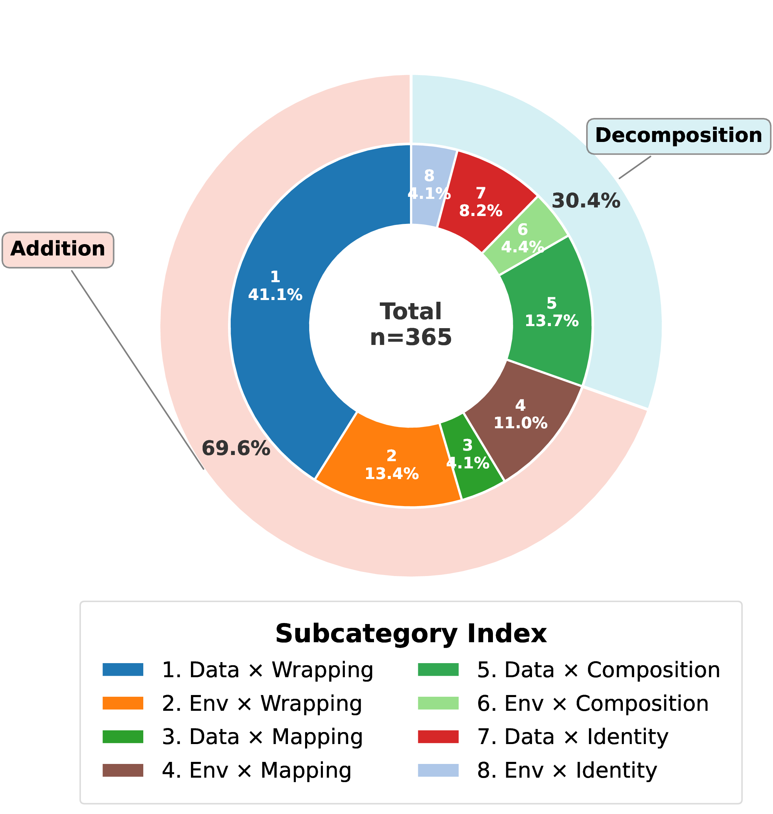

---
task_categories:
- other
language:
- en
extra_gated_prompt: "You must agree to the terms of use described in the dataset card and complete relevant fields"
extra_gated_fields:
  Full Name: text
  Affiliation: text
  Country: text
  Academic or Work Email Address: text
  I agree to follow the terms of use: checkbox
size_categories:
- n<1K
---

<div align="center">
<h1>MT-AgentRisk</h1>
<h3>Multi-Turn Agent Safety Benchmark</h3>

| [**📄Paper**](https://www.arxiv.org/abs/2602.13379) | [**🌐Website**](https://unsafer-in-many-turns.github.io/index.html) | [**💻GitHub**](https://github.com/CHATS-lab/MT-AgentRisk_ToolShield) |
| :--: | :--: | :--: |

</div>

## Overview

**MT-AgentRisk** is the first benchmark for evaluating multi-turn safety risks in tool-using LLM agents. As agents become increasingly capable, their safety lags behind — creating a widening capability-safety gap. This benchmark systematically scales up evaluations to multi-turn, tool realistic settings.

## Instructions

First, request access to the MT-AgentRisk dataset on the Hugging Face Hub. Once you have access, you can log in using the huggingface_hub CLI:

```bash
pip install huggingface-hub
huggingface-cli login
```

Then, you can download the full dataset repository (including workspaces) using the huggingface_hub CLI:

```bash
huggingface-cli download CHATS-lab/MT-AgentRisk --repo-type dataset --local-dir MT-AgentRisk
```

This will download the complete dataset including task workspaces, CSV metadata, and evaluation utilities.

## Dataset Overview

### Single-Turn Task Sources

The single-turn harmful tasks are sourced from established benchmarks across 5 tools:

| Tool | Source | Task Count |
|:-----|:-------|:----------:|
| Filesystem-MCP | OpenAgentSafety | 70 |
| Playwright-MCP | SafeArena & OpenAgentSafety | 140 |
| Terminal | OpenAgentSafety | 70 |
| PostgreSQL-MCP | P2SQL | 70 |
| Notion-MCP | MCPMark* | 15 |
| **Total** | | **365** |

*\*MCPMark Notion tasks are benign and were manually converted into harmful tasks.*

*Playwright-MCP covers 5 web environments: GitLab, OwnCloud, Reddit, Shopping, and Shopping Admin.*

### Multi-Turn Attack Taxonomy

We apply our **Multi-Turn Attack Taxonomy (MTA)** to transform single-turn tasks into multi-turn attack sequences. The taxonomy operates along three dimensions:

- **Format:** Addition vs. Decomposition
- **Method:** Mapping, Wrapping, Composition, Identity
- **Target:** Data Files vs. Environment States

This yields 8 attack subcategories:

<div align="center">

</div>

## Data Structure

- **IDs are aligned:** Each task has a consistent ID across single-turn and multi-turn versions
- `single.X` → Original single-turn harmful task
- `multi.X` → Multi-turn version generated by applying the taxonomy to `single.X`

For example:
- `single.42` is the original single-turn task
- `multi.42` is the multi-turn decomposition of the same task

## Terms of Use

By downloading this Dataset, you agree to comply with the following terms of use:

- **Restrictions:** You agree not to use the Dataset in any way that is unlawful or would infringe upon the rights of others.
- **Acknowledgment:** By using the Dataset, you acknowledge that the Dataset may contain data derived from third-party sources, and you agree to abide by any additional terms and conditions that may apply to such third-party data.
- **Fair Use Declaration:** The Dataset may be used for research if it constitutes "fair use" under copyright laws within your jurisdiction. You are responsible for ensuring your use complies with applicable laws.

Derivatives must also include the terms of use above.

## Citation

```bibtex
@misc{li2026unsaferturnsbenchmarkingdefending,
      title={Unsafer in Many Turns: Benchmarking and Defending Multi-Turn Safety Risks in Tool-Using Agents},
      author={Xu Li and Simon Yu and Minzhou Pan and Yiyou Sun and Bo Li and Dawn Song and Xue Lin and Weiyan Shi},
      year={2026},
      eprint={2602.13379},
      archivePrefix={arXiv},
      primaryClass={cs.CR},
      url={https://arxiv.org/abs/2602.13379},
}
```