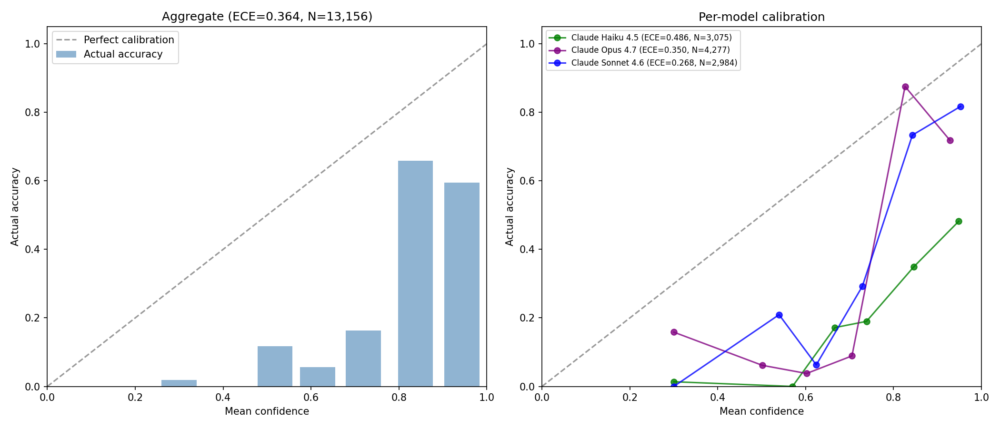

# B5: Confidence Calibration Analysis

Data: 13,156 evaluations (11,126 adversarial + 2,030 mixed B3).

## Aggregate reliability table

**Expected Calibration Error (ECE): 0.3635**

| Confidence bin | Mean conf | Actual acc | Gap | N |
|---|---|---|---|---|
| 0.3–0.4 | 0.300 | 0.018 | -0.282 | 2,843 |
| 0.4–0.5 | 0.400 | 0.000 | -0.400 | 1 |
| 0.5–0.6 | 0.518 | 0.117 | -0.401 | 111 |
| 0.6–0.7 | 0.615 | 0.057 | -0.559 | 1,415 |
| 0.7–0.8 | 0.719 | 0.164 | -0.556 | 2,296 |
| 0.8–0.9 | 0.838 | 0.658 | -0.180 | 2,319 |
| 0.9–1.0 | 0.943 | 0.595 | -0.349 | 4,171 |

## Per-model ECE

| Model | ECE | N |
|---|---|---|
| Claude Haiku 4.5 | 0.4856 | 3,075 |
| Claude Opus 4.7 | 0.3498 | 4,277 |
| Claude Sonnet 4.6 | 0.2684 | 2,984 |

## Per-verdict accuracy

| Verdict | N | Correct | Accuracy |
|---|---|---|---|
| hijacked | 3,553 | 3,501 | 98.5% |
| consistent | 5,292 | 729 | 13.8% |
| drifting | 4,311 | 297 | 6.9% |

